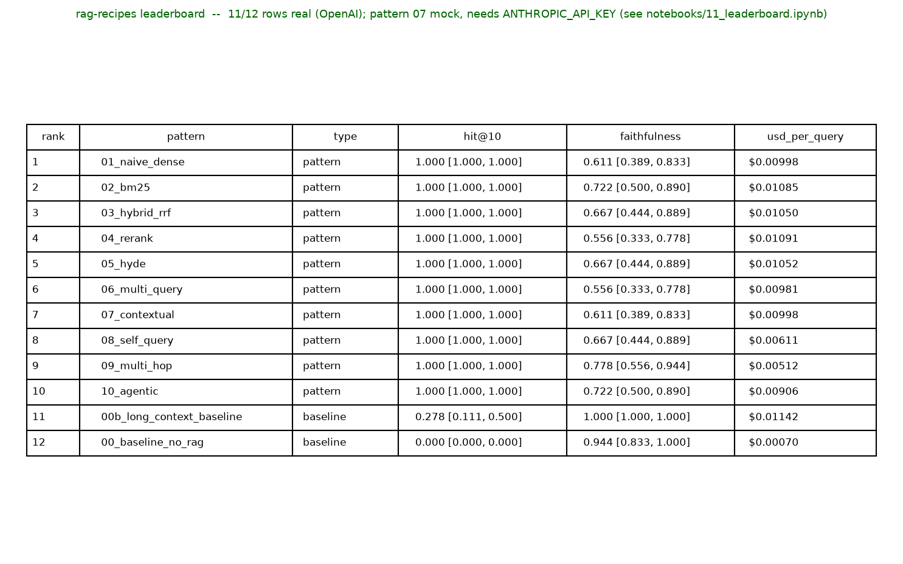

# rag-recipes

10 RAG patterns as runnable notebooks, benchmarked on the same corpus and eval set. Copy any
pattern into your own project.

## Project status

The pipeline is fully built and has been run for real: **11 of the 12 leaderboard rows below are
real retrieval-quality results** (real `text-embedding-3-small` embeddings, real `gpt-4.1-mini`
generation, real `gpt-5.4-mini` judging) against this repo's 54-chunk pilot corpus. Pattern 07
(contextual retrieval) still shows mock numbers -- it needs `ANTHROPIC_API_KEY`, which hasn't been
run yet. The A1 chunking study is fully real (all 6 variants); A2's embedding swap has its OpenAI
row real, with the Voyage and local-model rows still pending. Scores below are honest for this
pilot-scale corpus, not the larger corpus this project could eventually scale to -- see "How the
eval works" for the actual numbers.

## Leaderboard



Full detail (every metric, 95% CIs, cost) in [`outputs/leaderboard.md`](outputs/leaderboard.md).
Reproduce it yourself: [`notebooks/11_leaderboard.ipynb`](notebooks/11_leaderboard.ipynb).

**[Skip to results →](notebooks/11_leaderboard.ipynb)**

## What wins by default?

- **General default:** hybrid retrieval + cross-encoder rerank (patterns 03 + 04) -- strong,
  low-surprise baseline for most corpora.
- **Jargon-heavy corpora** (queries phrased very differently from your documents' language):
  contextual retrieval (pattern 07) or HyDE (pattern 05).
- **Small corpora** (under ~200 pages): the long-context baseline (00b) can beat retrieval
  entirely, with none of the engineering overhead.

See [`docs/choosing.md`](docs/choosing.md) for the full decision tree.

## Quick Start

```bash
git clone https://github.com/rajeshm71/rag-recipes && cd rag-recipes
uv sync
cp .env.example .env   # fill in OPENAI_API_KEY (and ANTHROPIC_API_KEY for pattern 07)
jupyter lab notebooks/
```

## Cost warning

**Measured, not estimated:** a clean-cache run of the full leaderboard (18-question pilot eval set
× 12 patterns/baselines, 11 of them real) cost **$1.89** in `eval_usd`, using
`gpt-4.1-mini-2025-04-14` for generation and `gpt-5.4-mini-2026-03-17` for judging. This is the
pilot-scale (54-chunk corpus, 18 questions) figure, not the larger scale this project could
eventually grow into -- a bigger corpus and eval set would cost proportionally more, since judge
calls (not generation) dominate the cost. Judge calls are cached to disk
(`outputs/.judge_cache/`) so re-running a notebook doesn't re-bill identical judge calls; delete
that directory first if you want a genuine from-scratch cost figure of your own.

## Which pattern should I use?

See [`docs/choosing.md`](docs/choosing.md) for a full decision tree, or skim the table below.

## The 10 patterns

| # | Pattern | Notebook | Key claim to test |
|---|---|---|---|
| 01 | Naive dense retrieval | [01_naive_dense.ipynb](notebooks/01_naive_dense.ipynb) | Baseline. Fails on rare terms |
| 02 | BM25 | [02_bm25.ipynb](notebooks/02_bm25.ipynb) | Baseline. Fails on paraphrase |
| 03 | Hybrid + RRF | [03_hybrid_rrf.ipynb](notebooks/03_hybrid_rrf.ipynb) | Beats either alone almost always |
| 04 | Cross-encoder rerank | [04_rerank.ipynb](notebooks/04_rerank.ipynb) | Single best add-on. Costs latency |
| 05 | HyDE | [05_hyde.ipynb](notebooks/05_hyde.ipynb) | Helps when query and doc language differ |
| 06 | Multi-query decomposition | [06_multi_query.ipynb](notebooks/06_multi_query.ipynb) | Helps ambiguous queries. Doubles cost |
| 07 | Contextual retrieval (Anthropic) | [07_contextual.ipynb](notebooks/07_contextual.ipynb) | Best for long docs. One-time indexing cost |
| 08 | Metadata + self-query | [08_self_query.ipynb](notebooks/08_self_query.ipynb) | Needed when corpus has structure |
| 09 | Multi-hop retrieval | [09_multi_hop.ipynb](notebooks/09_multi_hop.ipynb) | For chained-fact questions |
| 10 | Agentic RAG | [10_agentic.ipynb](notebooks/10_agentic.ipynb) | Most flexible. Hardest to debug |

Each pattern is both a notebook (with a required "Where this pattern FAILS" section -- wins alone
aren't the point) and an importable function in `recipes/<pattern>.py`. To use one in your own
project, copy the file directly -- this repo is a recipe collection, not an installable library.

## Appendices

- [00: No-RAG baseline](notebooks/00_baseline_no_rag.ipynb) -- same eval set, no retrieval, parametric memory only
- [00b: Long-context baseline](notebooks/00b_long_context_baseline.ipynb) -- stuff the whole corpus into context instead of retrieving
- [A1: Chunking study](notebooks/A1_chunking_study.ipynb) -- fixed-256/512/1024, semantic, document-aware, late chunking, retrieval held constant
- [A2: Embedding swap](notebooks/A2_embedding_swap.ipynb) -- `text-embedding-3-small` vs. `voyage-4` vs. local `bge-large-en-v1.5`, retrieval held constant

## How the eval works

Current pilot-scale corpus and eval set (scaling this up to a larger corpus/eval set is a possible
future direction):

- **Corpus:** [`corpus/corpus.jsonl`](corpus/corpus.jsonl) -- 54 chunks from 18 real arXiv papers
  (`cs.CL`/`cs.LG`/`cs.AI`, 2025), built by [`corpus/build_corpus.py`](corpus/build_corpus.py) and
  committed pre-built (no download step at first run).
- **Eval set:** [`evals/qa_set.jsonl`](evals/qa_set.jsonl) -- 18 hand-authored Q&A pairs across
  keyword, paraphrase, multi-hop, and filter-dependent categories.
- **Metrics:** hit@3, hit@10, MRR (deterministic), faithfulness/answer relevance/citation accuracy
  (LLM-as-judge), p50/p95 latency, $/query, eval cost -- every metric reported with a 95% bootstrap
  confidence interval (1000 resamples), since point estimates on this sample size are easy to
  over-interpret. See [`evals/metrics.py`](evals/metrics.py).

## Non-goals

Explicitly out of scope for this repo: multimodal RAG (images, tables inside PDFs), Graph RAG
(different mental model, deserves its own repo), fine-tuning embeddings, production infrastructure
(drift monitoring, feature stores, online evals), serving/streaming benchmarks.

## Contributing

See [`CONTRIBUTING.md`](CONTRIBUTING.md) for how to use this repo, report a bug, or add a new
pattern.

## License

[MIT](LICENSE)
