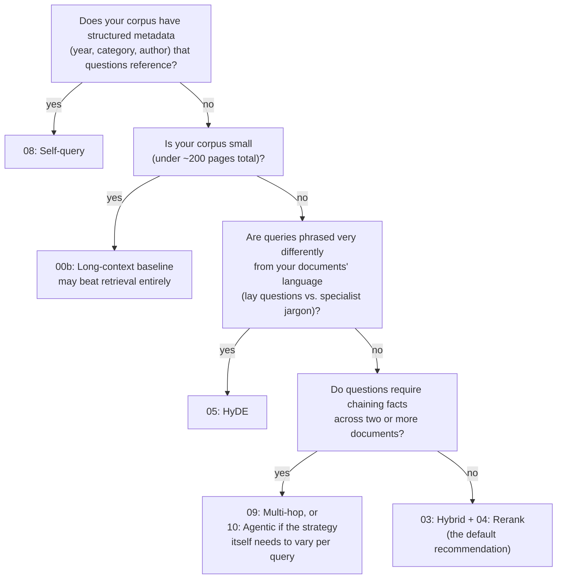

# Which pattern should I use?

Ten patterns is a lot to choose from. Most real corpora don't need all of them -- this page walks
through the questions that actually narrow it down, then points at the specific notebook to read.

## Decision tree

## The questions, in prose

**Does your corpus have structured metadata that queries reference?** ("papers from 2024 on X,"
"the cs.LG ones") -- if so, [pattern 08 (self-query)](../notebooks/08_self_query.ipynb) extracts a
filter before retrieving, instead of hoping semantic similarity alone surfaces the right subset.

**Is your corpus small?** Under roughly 200 pages, [the long-context
baseline](../notebooks/00b_long_context_baseline.ipynb) -- just stuffing everything into the
model's context window -- can outperform retrieval entirely, with none of retrieval's engineering
overhead. Worth checking before building anything else.

**Are queries phrased very differently from your documents' language?** Conversational questions
against formal technical writing is the classic mismatch dense embeddings struggle with.
[HyDE (pattern 05)](../notebooks/05_hyde.ipynb) embeds a hypothetical answer instead of the raw
question, which tends to land closer to real answer passages in embedding space.

**Are queries multi-hop** -- do they require chaining facts across two or more documents that
don't share much vocabulary with each other? Try [multi-hop (pattern
09)](../notebooks/09_multi_hop.ipynb) for a bounded, sequential search-then-decide loop, or [agentic
(pattern 10)](../notebooks/10_agentic.ipynb) if you don't know in advance how many hops or which
retrieval strategy (keyword vs. semantic) a given question will need.

**Otherwise:** [hybrid + rerank (patterns 03 and 04
combined)](../notebooks/03_hybrid_rrf.ipynb) is the default recommendation -- it's the pattern this
project's own appendix studies ([A1](../notebooks/A1_chunking_study.ipynb),
[A2](../notebooks/A2_embedding_swap.ipynb)) hold constant while varying everything else, precisely
because it's a strong, low-surprise baseline for the common case.

## What this page doesn't cover

Contextual retrieval (pattern 07) isn't in the tree above because it's less a "which pattern"
choice than a preprocessing decision: use it when your chunks lose meaning read in isolation
(pronouns and references to "the model described above" with no antecedent in the chunk itself),
regardless of which retrieval pattern you layer on top. See
[07_contextual.ipynb](../notebooks/07_contextual.ipynb) for the cost tradeoff (one-time
contextualization cost, only economical with prompt caching).
